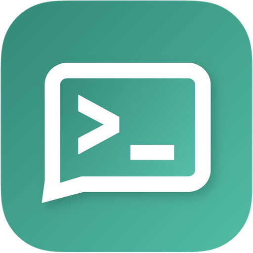

# Notify

<p align="center">
  
</p>

**Notify：Unraid 多项目通知与交互中枢容器。**

把散落在 Unraid 上的「通知 / 交互」脚本（如 `ddns-cmd`、`allinssl-cmd` 之类）收编进一个独立容器，做到：

- **不污染 Unraid**：拆掉 `/boot/config/*cmd*`、user.scripts 里对应项，系统恢复干净
- **不污染原容器**：不是取代 DDNS-GO / AllinSSL / iStoreOS，只是在它们之上做增强，只读其数据源
- **通用可扩展**：全局设置 + 按项目自由增删实例（需要几个加几个）
- **自定义优先**：内置模板只是「预填的自定义配置」，任何字段都能覆写，加新项目无需改代码

## 定位

Notify 与 WeComHub 的分工：

| 项目 | 角色 |
|---|---|
| `WeComHub` | 企业微信专用通道（Unraid 插件：通知出 + 指令入） |
| `Notify` | **多项目**通知与交互中枢（Docker 容器，一个容器管多个项目实例） |

Notify 面向的是「一个中转服务后面挂着好几个内网项目」的场景：每个项目在容器里是一个独立实例，有自己的端口、数据源和命令白名单，但共用同一套全局配置（中转地址、令牌、企微凭据）。

## 架构

```
企业微信
   ↓↑
中转服务（公网固定 IP，占位符 RELAY_HOST）
   ↓↑  frp 隧道（remotePort → 容器监听端口）
Notify 容器（host 网络）
   ├── 全局设置
   └── 项目实例 1..N
        ├── ddns-go    :8283  （只读其配置文件）
        ├── allinssl   :8285  （只读其 data.db）
        └── istoreos   （经隧道直连其 CGI API，无内网 agent）
```

## 快速开始

```bash
docker run -d \
  --name notify \
  --network host \
  -e RELAY_HOST=RELAY_HOST \
  -e RELAY_PUSH_TOKEN=*** \
  -v /mnt/user/appdata/notify/config:/config \
  -v /mnt/user/appdata/ddns-go/data/.ddns_go_config.yaml:/data/ddns_go_config.yaml:ro \
  -v /mnt/user/appdata/allinssl/data.db:/data/allinssl.db:ro \
  ghcr.io/deltrivx/notify:latest
```

> 以上均为**占位符**，请替换为你自己的值。仓库与文档中不含任何真实凭据。

## 配置

见 [docs/configuration.md](docs/configuration.md)。

## 构建

**所有镜像由 GitHub Actions 云端构建并推送 GHCR，禁止本地构建后上传。**

推送 `v*` tag 即触发构建。本地 `docker build` 仅供自测。

## 许可

见 [LICENSE](LICENSE)。
